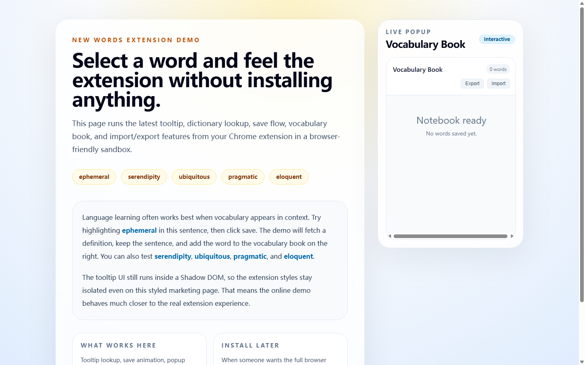

# New Words Extension · 生词插件

A minimalist Chrome extension (Manifest V3): select any English word on a page to get instant definitions and audio in a floating tooltip, save it to a vocabulary book, and import/export your collection.

极简 Chrome 生词扩展（Manifest V3）：网页划词即查英英释义与发音（悬浮窗），一键存入生词本，支持导入导出。

**▶ Try it without installing: https://sunnywang666.github.io/new-words-extension/**



**Highlights**：tooltip UI runs inside a Shadow DOM so extension styles never clash with host pages / 悬浮窗跑在 Shadow DOM 里，与宿主页面样式完全隔离；the online demo sandbox reproduces the real extension behaviors (tooltip, save flow, popup, import/export) in a plain browser page / 在线 demo 无需安装即可体验完整扩展行为。

**Tech**：Chrome Extensions API (MV3, content script + service worker) · React · TypeScript · Vite · Free Dictionary API

---

This repository contains:

- the latest Chrome extension source in [`public/extension`](./public/extension)
- a shareable online demo built with Vite + React
- the project history reconstructed from your local milestone snapshots

## Online Demo

After GitHub Pages is enabled for this repository, the demo will be available at:

`https://sunnywang666.github.io/new-words-extension/`

The demo lets people:

- select a word and open the tooltip
- fetch definitions from the Free Dictionary API
- save words into the vocabulary book
- preview the popup UI
- test import/export behavior

## Local Development

Prerequisite: Node.js 20+

```bash
npm install
npm run dev
```

## Build

```bash
npm run build
```

## Load As A Chrome Extension

1. Open `chrome://extensions`
2. Enable Developer mode
3. Click `Load unpacked`
4. Select the [`public/extension`](./public/extension) folder

## Deploy To GitHub Pages

This repo includes a GitHub Actions workflow that builds and deploys the Vite app to GitHub Pages on every push to `main`.
